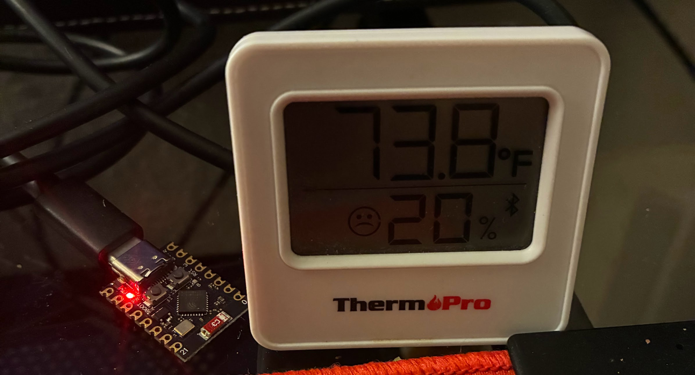
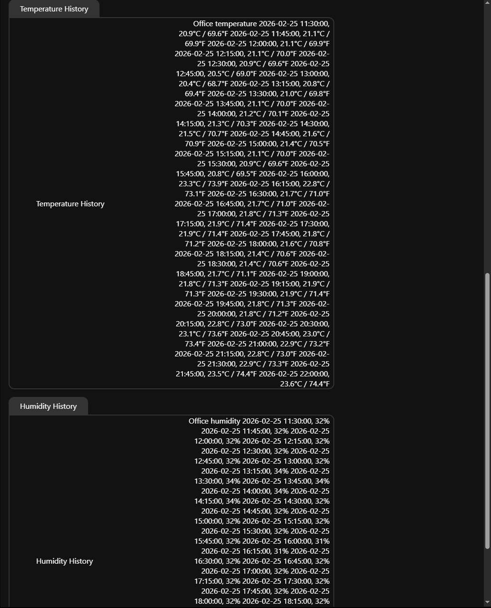
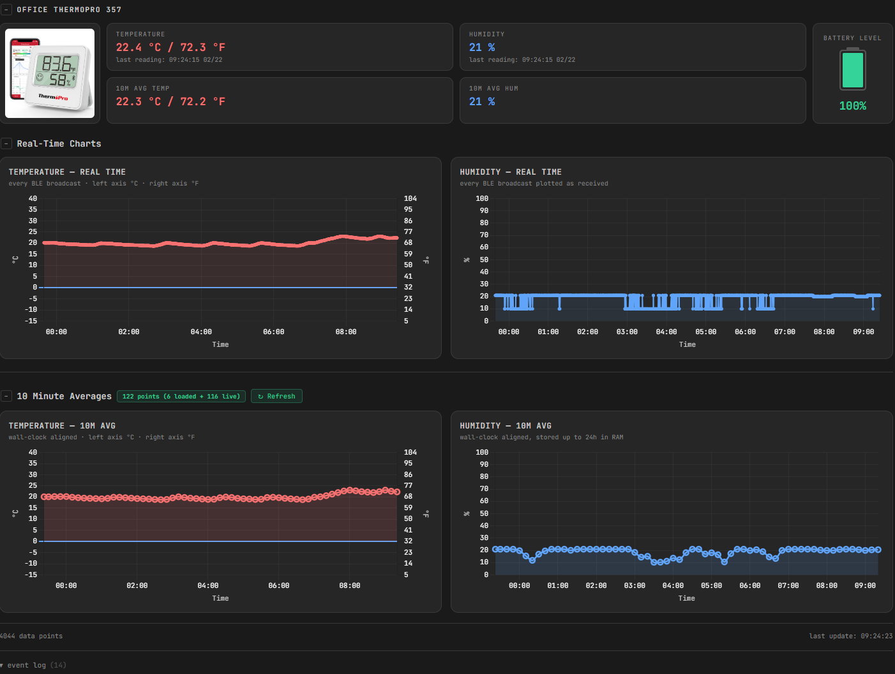
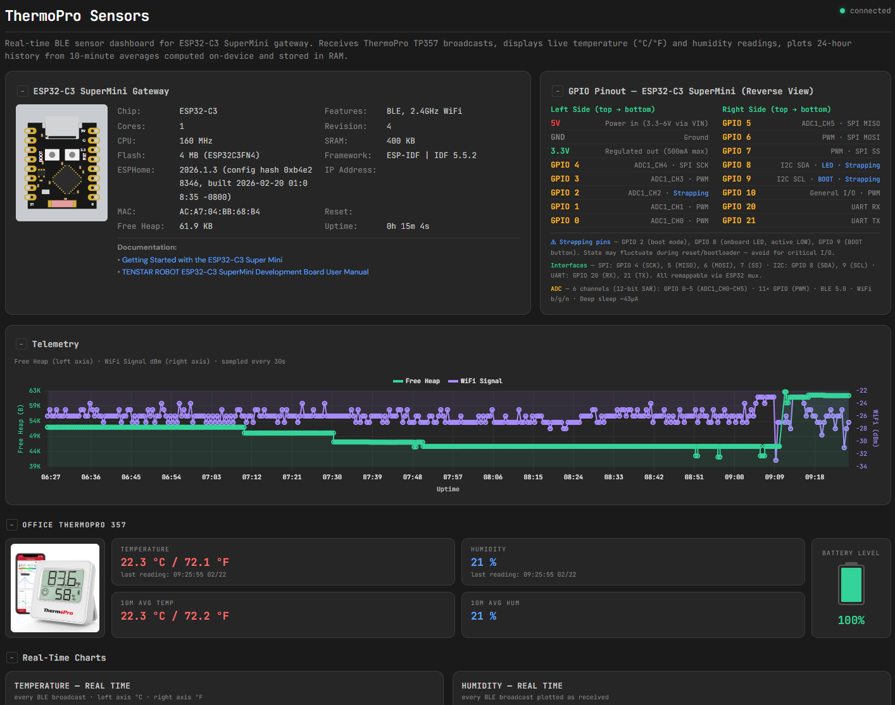

# ESP32-C3 ThermoPro BLE Gateway

A standalone BLE-to-WiFi gateway built on the **ESP32-C3 SuperMini** microcontroller. It passively receives temperature and humidity broadcasts from a **ThermoPro TP357** Bluetooth sensor, computes 15-minute rolling averages, stores 24 hours of history in RAM, and serves everything through a built-in web interface and a standalone HTML dashboard with real-time charts.

No cloud services required. No Home Assistant required. No database. Just an ESP32, a BLE sensor, and your browser. Optionally accessible from the internet via Cloudflare reverse proxy or cloudflared tunnel with HTTPS.

---

## Table of Contents

- [What It Does](#what-it-does)
- [How It Works](#how-it-works)
- [Hardware](#hardware)
- [Software Architecture](#software-architecture)
- [Project Files Structure](#project-files-structure)
- [Installation](#installation)
- [Configuration](#configuration)
- [Web Interfaces](#web-interfaces)
- [Remote Access via Cloudflare](#remote-access-via-cloudflare)
- [Data Flow](#data-flow)
- [Memory Budget](#memory-budget)
- [Temperature Display](#temperature-display)
- [Design Decisions and Limitations](#design-decisions-and-limitations)
- [Troubleshooting](#troubleshooting)
- [Screenshots and Photos](#screenshots-and-photos)
- [Version History](#version-history)
- [Future Plans](#future-plans)
- [Acknowledgments](#acknowledgments)
- [License](#license)

---

## What It Does

The gateway solves a simple problem: you have a cheap BLE temperature/humidity sensor and you want to see its data on a proper dashboard with historical charts — without running a server, a database, or Home Assistant.

**Capabilities:**

- Receives BLE advertisements from ThermoPro TP357 sensors (~every 10–20 seconds)
- Displays live temperature (°C and °F) and humidity readings
- Computes 15-minute rolling averages aligned to wall-clock boundaries (:00, :15, :30, :45)
- Stores 24 hours of averaged history in RAM (96 entries per sensor)
- Serves two web interfaces:
  - **ESPHome web page** (port 80) — built-in card-based UI with grouped readings
  - **HTML dashboard** (standalone file) — dark-themed responsive dashboard with five Chart.js graphs
- Exposes data via REST API and Server-Sent Events (SSE) for real-time streaming
- Validates all BLE readings (NaN guards, physical range checks)
- Accessible remotely via Cloudflare reverse proxy or cloudflared tunnel
- Runs indefinitely without reboots, heap fragmentation, or memory leaks

---

## How It Works

```
ThermoPro TP357            ESP32-C3 SuperMini              Your Browser
┌──────────────┐    BLE   ┌──────────────────┐   WiFi    ┌───────────────┐
│ Temperature  │ ──────►  │ BLE Listener     │ ◄──────── │ HTML Dashboard│
│ Humidity     │ advert.  │ NaN/Range Guard  │  SSE/REST │ (Chart.js)    │
│ Battery      │          │ 15min Averager   │ ────────► │ 5 live charts │
└──────────────┘          │ Ring Buffer (RAM)│           │ Device info   │
                          │ Web Server :80   │           │ GPIO pinout   │
                          │ REST API         │           └───────────────┘
                          └──────────────────┘
                                   │
                           ┌───────┴────────┐
                           ▼                ▼
                    ESPHome Web Page   Cloudflare Proxy
                     (LAN :80)        (Internet HTTPS)
```

1. The ThermoPro TP357 broadcasts BLE advertisement packets containing temperature, humidity, and battery level. No pairing needed from sensor or ESP32 side.

2. The ESP32-C3's BLE stack receives these packets. Each reading is validated (reject NaN, reject temperature outside -50°C to +80°C, reject humidity outside 0–100%).

3. Valid readings accumulate in global sum/count variables. Every 15 minutes (on wall-clock boundaries via SNTP cron), the averages are computed, stored in a ring buffer, and published to text sensors.

4. **LAN access:** The web server streams updates via SSE. The HTML dashboard connects to `/events`, listens for `state` events, and plots data in real time. Historical data is fetched once on page load from `/text_sensor/Temperature%20History` and `/text_sensor/Humidity%20History`.

5. **Internet access:** Is implemented by registering and hosting domain at Cloudflare. When accessed through Cloudflare, the Internet dashboard uses REST polling instead of SSE (Cloudflare buffers SSE streams). The same REST endpoints are polled every 15 seconds, feeding data through the identical `handleState()` function.

---

## Hardware

### ESP32-C3 SuperMini

| Spec | Value |
|------|-------|
| SoC | ESP32-C3 (RISC-V single-core, 160 MHz) |
| RAM | ~400 KB SRAM (~300 KB usable) |
| Flash | 4 MB |
| Connectivity | WiFi 802.11 b/g/n + BLE 5.0 |
| Size | 22.5 × 18 mm |
| Power | USB-C (5V) or 3.3V pin |
| GPIO | 13 usable pins (ADC, I2C, SPI, UART) |

The SuperMini is one of the smallest ESP32-C3 development boards available. Its compact size makes it ideal for embedding into sensor enclosures or tucking behind furniture.

### ThermoPro TP357

| Spec | Value |
|------|-------|
| Protocol | BLE 5.0 advertisement (no pairing) |
| Temperature range | -20°C to +60°C (±0.5°C accuracy) |
| Humidity range | 10–99% RH (±2–3% accuracy) |
| Broadcast interval | ~10–20 seconds |
| Battery | 1 AAA battery (6–9 months life) |
| MAC address | Configure in ESP32 YAML (`mac_address` field) |

### Wiring

None. The ESP32-C3 only needs USB power. BLE reception is wireless. The antenna is integrated on the SuperMini board — no external antenna needed for couple of room reception (typical range 5–10 meters through walls).

---

## Software Architecture

The project runs on [ESPHome](https://esphome.io/), an open-source firmware framework for ESP32/ESP8266 microcontrollers. ESPHome compiles YAML configuration into a firmware file that is flashed over USB or OTA. The firmware uses Espressif's native **ESP-IDF framework** (not Arduino) for better BLE + WiFi coexistence and lower memory overhead on the single-core ESP32-C3.


### Key Components

| Component | Purpose |
|-----------|---------|
| `esp32_ble_tracker` | Passive BLE scanning for sensor advertisements |
| `thermopro_ble` | Decodes ThermoPro TP357 BLE packet format |
| `web_server` (v3) | Built-in HTTP server with SSE and REST API |
| `sntp` | NTP time sync for wall-clock aligned averaging |
| `sensor_history.h` | C++ ring buffer with formatted display output |
| `api` | Home Assistant integration (kept for boot stability) |

---

## Project Files Structure

```
esp32-c3-thermopro/
├── README.md                               ← this file
├── esp32-c3-thermopro.yaml                 ← ESPHome firmware configuration
├── sensor_history.h                        ← C++ ring buffer and formatters
├── thermopro-dashboard-LAN.html            ← LAN dashboard (SSE, file:// or local)
├── thermopro-dashboard-internet.html       ← Internet dashboard (REST polling, Cloudflare)
├── secrets.yaml                            ← WiFi credentials (not committed)
└── images/                                 ← screenshots and photos for documentation
```

### `esp32-c3-thermopro.yaml` 

The main firmware configuration. Defines:

- WiFi and API settings
- BLE sensor binding (MAC address, reading handlers)
- NaN/range validation on every BLE reading
- 15-minute averaging lambda (wall-clock aligned cron trigger)
- Text sensors for current readings, averages, and history
- Web server with sorting groups for organized card layout
- Device info parser (splits debug string into individual fields)
- Description card published once at boot

### `sensor_history.h` 

C++ header included at compile time. Contains:

- `HistoryBuffer` — generic ring buffer class (96 entries × 8 bytes each)
- `write_formatted_to()` — outputs human-readable lines with units (°C/°F and %)
- `build_temp_history_display()` — builds formatted temperature history text
- `build_hum_history_display()` — builds formatted humidity history text
- `safe_append()` — bounds-checked string concatenation helper
- All buffers are statically allocated in BSS (no heap, no fragmentation)

### `thermopro-dashboard-LAN.html` — LAN Version 

Self-contained HTML file for LAN access. Connects to ESP32 via SSE for real-time streaming:

- Dark-themed responsive layout with collapsible sections
- Device info card + GPIO pinout diagram (side by side)
- Reading cards — 4-column grid: sensor photo, temp+avg, hum+avg, battery with SVG fill
- Five Chart.js graphs: live temp, live humidity, avg temp (24h), avg humidity (24h), telemetry (heap + WiFi)
- Dual Y-axis on temperature charts (°C left, °F right)
- SSE connection for instant live data streaming
- History loader that fetches 24h averages on page load
- Debug event log (collapsed by default)
- No build step, no dependencies beyond CDN-loaded Chart.js

### `thermopro-dashboard-internet.html` — Cloudflare/internet Version 

Same dashboard, modified for internet access through Cloudflare reverse proxy:

- REST polling every 15 seconds (replaces SSE which Cloudflare buffers/blocks)
- HTTPS host URL (`https://your-public-fqdn`)
- Value+epoch deduplication prevents duplicate avg chart points between 15-min intervals
- Connection status shows "connected (polling)" instead of "connected"
- All charts, cards, and display logic identical to LAN version

### `secrets.yaml` (To be created at ESPhome or can be hardcoded into YAML)

```yaml
wifi_ssid: "YourNetworkName"
wifi_password: "YourPassword"
```

---

## Installation

### Prerequisites

- [ESPHome](https://esphome.io/guides/installing_esphome.html) (2025.11.0 or later) and familiarity how to use it to flash firmware to ESP devices
- USB-C data cable for initial flash
- ThermoPro TP357 sensor
- Cloudflare setup (reverse proxy or cloudflared tunnel) - if access from Internet is required

### Step 1: Find Your Sensor's MAC Address

If you don't know your ThermoPro's MAC address, you can use Windows/Linux BLE monitoring/tracker app or flash a temporary config into ESP32 with just the BLE tracker and check the logs:

```yaml
esp32_ble_tracker:
  on_ble_advertise:
    then:
      - lambda: |-
          ESP_LOGI("ble", "Found: %s (name: %s)",
                   x.address_str().c_str(),
                   x.get_name().c_str());
```

Look for a device named `TP357` or similar. Note the MAC address.

### Step 2: Configure/update YAML file for ESP board

1. Clone this repository
2. Create/define your WiFi credentials via `secrets.yaml` or hardcoding them into YAML file.
3. Edit `esp32-c3-thermopro.yaml`:
   - Update `mac_address` under `thermopro_ble` to match your sensor
   - Update `use_address` under `wifi` to your desired static IP
   - Update the `api` encryption key
   - Adjust `timezone` under `sntp`  if needed

### Step 3: Flash and access the ESP's web page

Use ESPhome and https://web.esphome.io to prepare the board for flashing and initial flash with built firmware. Once you upload the firmware, you can access the ESP's built-in web server by http://xx.xx.xx.xx where xx.xx.xx.xx is ESP's IP address


### Step 4: Access HTML SPA Dashboards

**LAN access:**
1. Edit `thermopro-dashboard-LAN.html` — set `ESP_HOST` to your ESP32's IP address:
   ```javascript
   var ESP_HOST = 'http://xx.xx.xx.xx';
   ```
2. Open the file in a computer or mobile device browser (Chrome, Firefox, Safari, Edge)
3. The dashboard connects via SSE and begins plotting immediately

**Internet access (requires Cloudflare setup):**
1. Edit `thermopro-dashboard-internet.html` — set `ESP_HOST` to your Cloudflare FQDN:
   ```javascript
   var ESP_HOST = 'https://your-public-fqdn';
   ```
2. Open from any browser, anywhere — REST polling begins automatically

You can also access the ESPHome built-in web page via internet at `https://your-public-fqdn`

---

## Configuration

### Changing the Averaging Interval

The default is 15 minutes. To change it:

1. In `esp32-c3-thermopro.yaml`, modify the cron trigger:
   ```yaml
   on_time:
     - seconds: 0
       minutes: /5    # ← change to 5-minute intervals
   ```
2. In `sensor_history.h`, update CAP:
   ```cpp
   static constexpr int CAP = 288;  // 24h ÷ 5min = 288 entries
   ```
3. In both HTML dashboards, update the label:
   ```javascript
   var AVG_INTERVAL = '5m';
   ```

**Memory impact:** shorter intervals mean more history entries. Buffer sizes scale automatically from CAP. At 5-minute intervals (CAP=288), BSS usage doubles from ~13 KB to ~26 KB, and heap copies grow proportionally.

### Changing the History Depth

In `sensor_history.h`, adjust:
```cpp
static constexpr int CAP = 96;  // 96 × 15min = 24 hours
```

Buffer sizes are derived from CAP, so they adjust automatically.

### Chart Temperature Range

Temperature charts default to -15°C to +40°C (outdoor-ready with a visible 0°C freezing line). Adjust in the HTML:
```javascript
var TEMP_MIN_C = -15, TEMP_MAX_C = 40;
```
### Sensor Name

In this PoC the sensor is named as Office ThermoPro 357. You can change the name in the YAML configuration and HTML pages accordingly.

---

## Web Interfaces

### ESPHome Web Page (port 80)

The built-in ESPHome web UI organizes data into card groups:

| Group | Contents |
|-------|----------|
| About This Gateway | One-line description of what this setup does |
| Office - Current Readings | Live temperature (°C/°F), humidity, timestamp |
| Office - 15 Minute Averages | Averaged temperature (°C/°F), humidity, battery |
| Diagnostics | Chip info, CPU, framework, IP, MAC, heap, uptime, WiFi signal |
| Temperature History | Full 24h history formatted as timestamped lines (°C/°F) |
| Humidity History | Full 24h history formatted as timestamped lines (%) |

Temperature readings throughout appear in dual format, like `21.3 °C / 70.3 °F`

### HTML Dashboard (LAN + Internet versions)

The standalone dashboards provide a richer visualization:

- **Collapsible sections** — click `−`/`+` icons to fold any card; content below flows up
- **Device info + GPIO pinout** — side by side at the top; SVG board diagram with labeled pins
- **Reading cards** — 4-column grid: sensor photo, current temp + avg, current hum + avg, battery level
- **Telemetry chart** — Free Heap (left axis) and WiFi Signal dBm (right axis) over time
- **Real-time charts** — temperature and humidity plotted at BLE broadcast rate (~10–20s)
- **Average charts** — 15-minute averages with up to 24 hours of loaded history
- **Temperature dual axis** — left Y-axis in °C, right Y-axis in °F, 0°C/32°F freezing line highlighted in blue
- **Tooltip** — hovering over point on charts shows heap, wifi signal, temperature or humidity readings
- **Refresh History button** — re-fetches 24h history from ESP32 without page reload
- **Debug event log** — collapsible log of all events for troubleshooting

---

## Remote Access via Cloudflare

The ESP32's web server can be accessed from the internet through a Cloudflare reverse proxy or cloudflared tunnel. This provides HTTPS encryption without adding TLS support to the ESP32 itself, and hides internal network IP address.

### Architecture - with Reverse Proxy

```
Browser (anywhere)          Cloudflare Edge          Your Router          ESP32-C3
┌───────────────┐  HTTPS   ┌────────────────┐  HTTP   ┌──────────┐  HTTP ┌───────────┐
│ Dashboard     │ ───────► │ TLS termination│ ──────► │ NAT/PAT  │ ────► │ :80       │
│ (Internet ver)│ ◄─────── │ Origin Rule    │ ◄────── │ port fwd │ ◄──── │ web_server│
└───────────────┘  HTTPS   │ (port rewrite) │  HTTP   │ ext→int  │  HTTP └───────────┘
                           └────────────────┘         └──────────┘
```

### Setup Steps

1. **Domain & DNS:** Register a domain. In Cloudflare DNS, create an A record pointing to your public IP with **Proxied** (orange cloud) enabled:
   ```
   Type: A    Name: esp1    Content: <your-public-IP>    Proxy: Proxied
   ```

2. **Port forwarding:** On your router/firewall, forward an external port (e.g., 51234) to the ESP32's internal IP and port 80:
   ```
   External: <public-IP>:51234  →  Internal: xx.xx.xx.xx:80
   ```

3. **Cloudflare Origin Rule:** In Cloudflare Rules → Origin Rules, create a rule:
   - **When:** Hostname equals `your-public-fqdn`
   - **Then:** Destination Port → Rewrite to `51234`
   - Leave Host Header, SNI, and DNS Record as "Preserve"

4. **Dashboard configuration:** Use the Internet HTML dashboard with HTTPS:
   ```javascript
   var ESP_HOST = 'https://your-public-fqdn';
   ```

### Why Two SPA Dashboard Versions?

The Internet dashboard replaces SSE with **REST polling**: it fetches each entity endpoint individually every 15 seconds. ESPHome's REST API returns the same JSON format as SSE payloads, so the `handleState()` function works identically. The tradeoff is ~15-second update latency instead of instant SSE, which is acceptable for a temperature monitor.

| Feature | LAN Version (SSE) | Internet Version (Polling) |
|---------|-------------------|---------------------------|
| Connection | `EventSource('/events')` | `fetch()` every 15s |
| Latency | Instant (~100ms) | Up to 15 seconds |
| Protocol | HTTP (direct to ESP) | HTTPS (via Cloudflare) |
| ESP32 load | 1 persistent SSE connection | 10–20 REST requests per cycle |
| Status indicator | "connected" | "connected (polling)" |
| Deduplication | Event-driven (no dupes) | Value+epoch based |

### Security Considerations

- Cloudflare provides DDoS protection and hides your home IP address
- HTTPS encrypts the browser-to-Cloudflare leg; Cloudflare-to-origin is unencrypted HTTP (ESP32 has no TLS)
- The ESP web server has no authentication — anyone with the URL can view sensor data
- Consider Cloudflare Access (Zero Trust) if you need login protection
- Always use `https://` in ESP_HOST, not `http://` — even though both work through Cloudflare, HTTPS encrypts the browser-to-edge connection

---

## Data Flow

### Live Readings (Real-Time Charts)

```
BLE broadcast → on_value lambda → NaN/range check → publish to text_sensor
                                      │
                                      ▼
                              accumulate in globals
                              (temp_sum, temp_count)
                                      │
                          ┌───────────┴───────────┐
                          ▼                       ▼
                   SSE "state" event       REST GET /text_sensor/...
                   (LAN dashboard)         (Internet dashboard, every 15s)
                          │                       │
                          ▼                       ▼
                   handleState() ◄────────────────┘
                          │
                          ▼
                   pushPoint() → Chart.js update
```

### Averaged Readings (Average Charts)

```
Every 15 min (cron) → compute avg = sum/count → store in HistoryBuffer
                                                      │
                            ┌─────────────────────────┤
                            ▼                         ▼
                    publish to text_sensor     build_temp_history_display()
                    (SSE/REST to dashboard)    build_hum_history_display()
                                                      │
                                        ┌─────────────┴─────────────┐
                                        ▼                           ▼
                              /text_sensor/                /text_sensor/
                              Temperature%20History        Humidity%20History
                              (fetched by dashboard on load)
```

### History Loading (Page Load)

```
Browser opens dashboard → 2s delay → fetch /text_sensor/Temperature%20History
                                     fetch /text_sensor/Humidity%20History
                                              │
                                              ▼
                                    parseFormattedHistory()
                                    (regex: timestamp + first number)
                                              │
                                              ▼
                                    populate avg chart datasets
                                    tempAvgChart.update()
                                    humAvgChart.update()
```

---

## Memory Budget

Ring buffer has 96 entries to keep data for 24h. All data storage uses static BSS allocation — no heap, no `malloc`, no fragmentation. The current setup has about 82KB free heap after startup.

---

## Temperature Display

All temperature values throughout the system are shown in dual format:

```
21.3 °C / 70.3 °F
```

This applies to:
- ESPHome web page: current readings, 15-minute averages, sensor history lines
- HTML dashboard: reading cards, chart tooltips
- HTML dashboard charts: left Y-axis (°C), right Y-axis (°F)

The conversion happens in two places:
- **On the ESP32** (YAML lambdas and `sensor_history.h`) — for the web page and REST API
- **In the browser** (JavaScript `cToF()` function) — for chart axes and tooltips

---

## Design Decisions and Limitations

### Setup Supports One Sensor

The current PoC/setup is designed to support just one sensor. While supporting multiple sensors is possible, it would impose severe memory limitations and make the current setup unnecessarily complex. To support multiple sensors the architecture needs to be changed by removing sensor history display from ESP's web page and changing framework. See the [Future Plans](#future-plans).

### Limited Number of Dashboard Connections

Despite the optimization (see [Version History](#version-history)) the current setup is still memory constrained. While free heap is about 83K after startup, every single browser dashboard session takes 3-6K heap causing ESP to crash after opening several dashboard sessions or refreshing the page frequently. Number of concurrent dashboard browser sessions should not exceed 3. Dashboard sessions should be closed when not used.

### No Dashboard Authentication

The current setup does not provide authentication to access either ESP web page or HTML dashboard.

### Why Static Buffers Instead of Heap Allocation?

ESP32 heap fragmentation is a real problem in long-running applications. After days of operation, `malloc` can fail even with plenty of "free" heap because the free space is fragmented into unusable small chunks. Static BSS buffers are allocated at boot, never freed, never fragmented. The 13 KB cost is predictable and permanent.

### 15-Minute Averaging

Original setup had 10 minutes averaging, however it imposed significant memory pressures. moving to 15 min averaging reduced ring buffer size from 144 to 96 entries while keeping full 24-hour history coverage.

### API Component In the Config

The `api:` block is not strictly needed for standalone operation (no Home Assistant connected). However, removing it caused boot failures — the ESP32-C3 entered safe mode repeatedly. The ESPHome initialization sequence appears to depend on the API component for internal socket/event-loop setup. The `reboot_timeout: 0s` setting prevents the API component from rebooting the device every 15 minutes when no HA client connects.

### Why Not Reduce Socket Count?

`CONFIG_LWIP_MAX_SOCKETS` is set to 13 that is requirement for 2026.2 ESPhome firmware - the ESP32-C3's init sequence allocates sockets for WiFi, BLE/NimBLE, mDNS, SNTP, web server, API listener, and OTA simultaneously. 

### Why REST Polling for Cloudflare Instead of SSE?

Cloudflare's reverse proxy buffers HTTP responses before forwarding them to the client. SSE (Server-Sent Events) is a long-lived HTTP response that never "completes" — Cloudflare holds it indefinitely, and the browser's `EventSource` never receives the `onopen` event. REST polling works because each request-response cycle completes quickly. The 15-second polling interval introduces minor latency but is perfectly acceptable for a temperature monitor.

### Why `addEventListener('state')` Instead of `onmessage`?

ESPHome web server v3 sends Server-Sent Events with a named event type `state`. The `onmessage` handler only catches *unnamed* events. Using `es.onmessage` would result in a dashboard that connects successfully (green dot) but never receives any data. This is a common ESPHome SSE pitfall.

### Why Not Serve the HTML from the ESP32?

ESPHome's web server doesn't support serving custom static files from SPIFFS/LittleFS. Opening a local `.html` file in the browser and pointing it at the ESP32's IP is simpler, faster, and doesn't tax the microcontroller.

### Why Entity Name URLs (`/text_sensor/Temperature%20History`)?

ESPHome is deprecating object ID-based URLs (`/text_sensor/sensor_history`) in favor of entity name-based URLs. The old format will be removed in ESPHome 2026.7.0. Using the name-based URL now eliminates the deprecation warning in logs and future-proofs the dashboard.

---

## Screenshots and Photos

### Hardware

ThermoPro TP357 sensor next to ESP32-C3 SuperMini gateway, connected via USB-C:



### ESPHome Built-in Web Page

The ESP32's native web interface showing card groups — About, Current Readings, 15-Minute Averages, and Diagnostics:


Temperature and Humidity History cards showing 24 hours of 15-minute averaged readings:



### HTML Dashboard

Device info card with GPIO pinout, telemetry chart (heap + WiFi signal), and sensor reading cards:



Real-time and averaged temperature/humidity charts with 24-hour history:



---

## Troubleshooting

### Dashboard shows "connecting..." / "polling..." but never turns green

**LAN version:**
- Verify `ESP_HOST` in the HTML matches the ESP32's actual IP
- Do not put `/` at the end of `xx.xx.xx.xx` - IP address of the ESP in the `ESP_HOST`
- Check that the ESP32 is on the same network/VLAN as your browser
- Browser CORS: opening the HTML file via `file://` should work; some browsers may block cross-origin fetch to `http://` — try serving it from a local web server

**Internet reverse-proxy version:**
- Verify Cloudflare DNS record is **Proxied** (orange cloud), not DNS-only
- Verify the Origin Rule rewrites the destination port to your forwarded port
- Check your router's port forwarding is active and pointing to the ESP32's IP
- Use `https://` (not `http://`) in `ESP_HOST` — Cloudflare may redirect HTTP to HTTPS, causing CORS issues
- Do not put `/` at the end of `your-public-fqdn` in the `ESP_HOST`
- Test by opening `https://your-public-fqdn/text_sensor/Current%20Temperature` directly in a browser — if this returns JSON, the proxy works and the issue is in the HTML

### Internet dashboard connects but SSE version doesn't work through Cloudflare

This is expected. Cloudflare buffers SSE streams. Use `thermopro-dashboard-internet.html` (REST polling version) for internet access. The LAN version (SSE) only works when the browser can reach the ESP32 directly.

### Dashboard connects (green dot) but shows "waiting for sensor data..."

- If using `onmessage` instead of `addEventListener('state')`, events are silently dropped. Ensure the SSE handler uses `addEventListener('state', ...)`
- Check ESPHome logs for BLE reception: `ESP_LOGI("ble", ...)` messages confirm packets are being received

### "Reboot request from API" in logs

- The API component's `reboot_timeout` is set too high or missing. Ensure `reboot_timeout: 0s` is present under `api:`


- The HTML dashboard is using the old object ID URL. Update the fetch URL to use entity name format (e.g., `/text_sensor/Temperature%20History`)

### Free heap dropping over time

- Monitor with the Diagnostics card or telemetry chart. The current version with optimization targets ~82 KB free heap. If free heap drops below 40 KB, check for:
  - Too many simultaneous browser tabs connected via SSE (LAN)
  - External processes hitting the REST API at high frequency
  - Memory leak in custom components (unlikely with static buffers)

### No BLE readings received

- Verify the MAC address in the YAML matches your sensor exactly
- Ensure the sensor has a fresh battery (low battery = weak broadcasts)
- Check distance — ESP32-C3 PCB antenna range is typically 5–10 meters
- Try adding `scan_parameters` to `esp32_ble_tracker` for tuning

### Charts show gaps in history

- Gaps occur when no valid readings arrive during a 15-minute window (BLE interference, sensor out of range)
- This is by design — the system records `nothing` rather than interpolating fake data
- History is lost on ESP32 reboot (RAM-only storage)

### ESP32 enters safe mode (web page unreachable, but pings respond)

- Safe mode disables all components except WiFi and OTA. The device is reachable by IP but the web server is down
- Usually caused by repeated boot crashes (10 consecutive failures triggers safe mode)
- Flash a known-good firmware via OTA
- Common causes: reducing `CONFIG_LWIP_MAX_SOCKETS` below 13, removing the `api:` component

---

## Version History

### v10 (current) — Stability Optimization

This was long way in making - the current version is v10 iteration and is considered PoC/demo ready. There are no plans to add features to this version, just bug fixes, if there are any.

---

## Future Plans

- **New architecture** - the new project will re-write the architecture by removing sensor history from ESP web page and changing framework
- **Multi-sensor dashboard** — support multiple sensors on HTML dashboard
- **Persistent history** — keep history on persistent storage to expand beyond 24 hours
- **Dashboard hosting** - host the HTML dashboard on via static web page on Github, S3 or Azure/GCP storage
- **Dashboard authentication** - implement authentication to access and protect dashboard

---

## Acknowledgments

This project was made possible with help from Claude Code.

---

## License

This project is provided as-is for personal and educational use. ESPHome is licensed under the MIT License. Chart.js is licensed under the MIT License. ThermoPro is a trademark of ThermoPro Technology.
